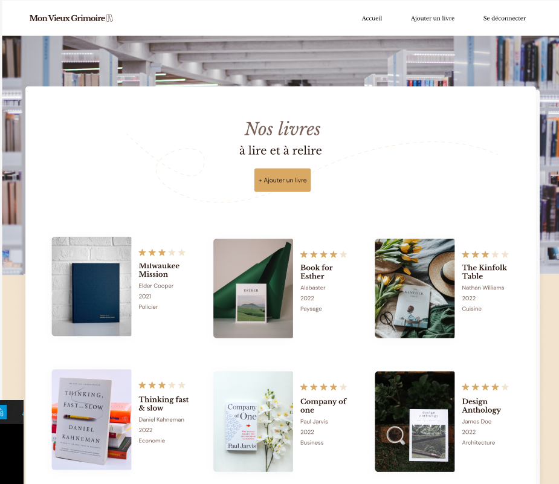

# Site web de librairies  - Mon vieux grimoire 

## Utilisation Front

### `yarn` ou `npm install`
### `yarn start` ou `npm start`

Ouvrir [http://localhost:3000](http://localhost:3000) pour le visualiser dans votre navigateur.

## Utilisation Back

### `yarn` ou `npm install`
### `nodemon`

## Présentation
### Technos

### Scenario 
Vous êtes développeur back-end en freelance, un développeur front-end plus expérimenté que vous vous propose de travailler avec lui en mutualisant vos compétences front / back sur un tout nouveau projet qui lui a été proposé.
Il s’agit d’une petite chaîne de librairies qui souhaite ouvrir un site de référencement et de notation de livres : Mon Vieux Grimoire.

### Missions
+ Creer un server express
+ Creer une API RESTful
+ Mettre en place un systeme d'authenfication
+ Ajouter une gestion d'images
+ Ajouter une gestion de l'optimisation des images
